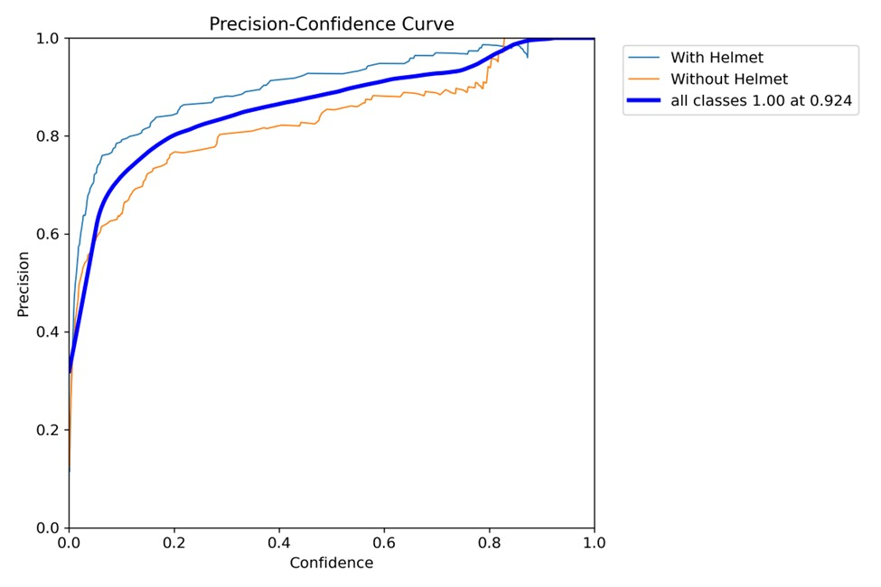
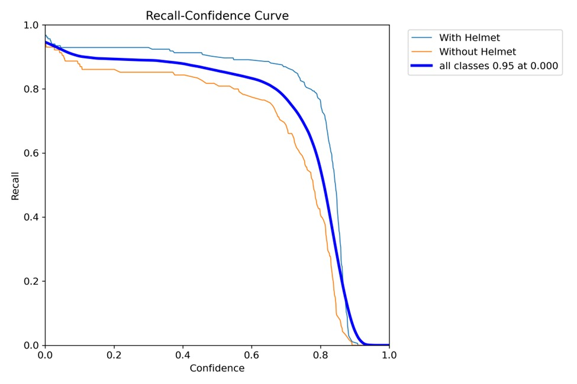
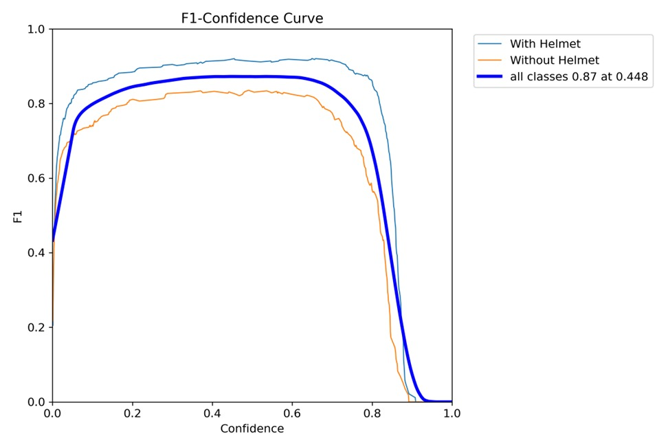
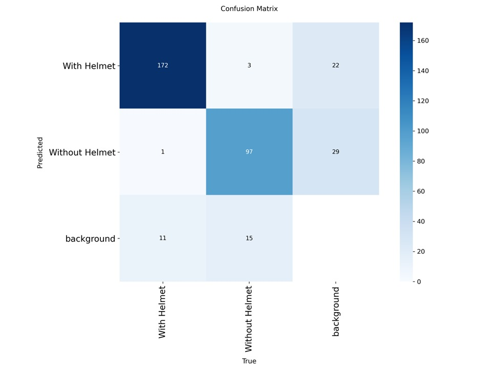
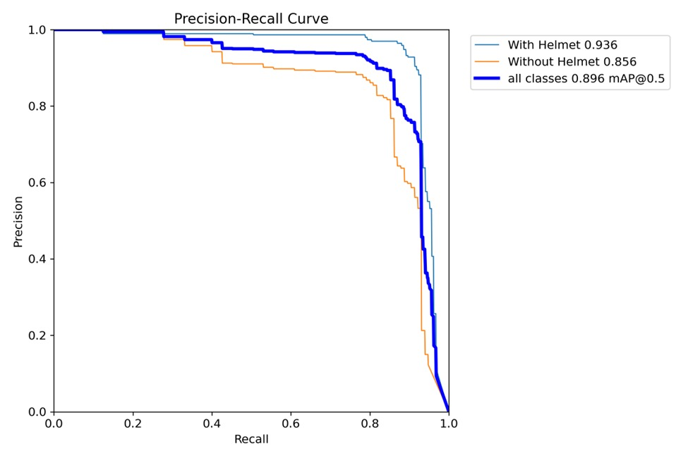
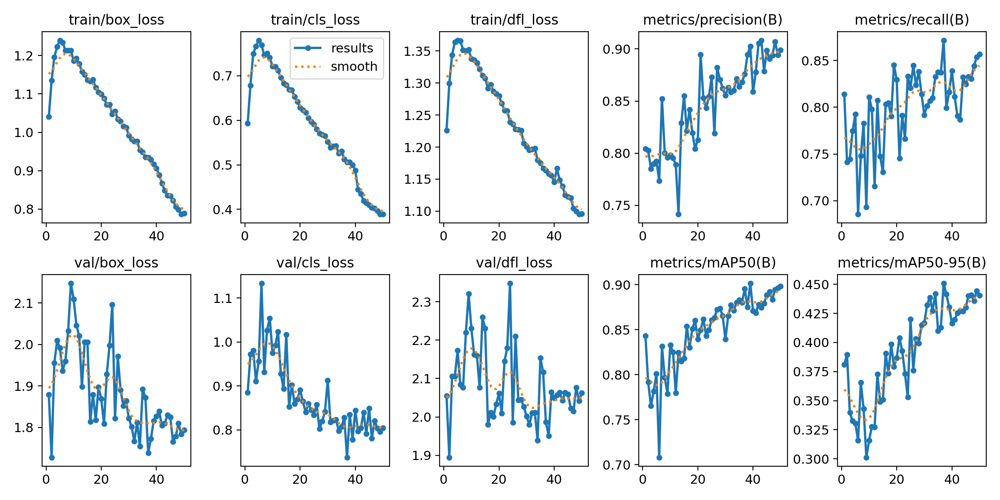

<div style="text-align:center;">

# 🚀 <span style="color:#00eaff;">AI Helmet Detection System</span>

### <span style="color:#7df9ff;">YOLOv8 • Roboflow Dataset • Real‑Time Tracking</span>

        

</div>

---

## ⚡ Overview

This project implements a **custom-trained YOLOv8 model** that detects whether motorcycle riders are wearing helmets. The model was trained for **100 epochs** using a high‑quality Roboflow dataset and includes **image detection**, **video detection**, and **real‑time object tracking** with persistent IDs.

---

## 🧠 Features

### 🔹 <span style="color:#00eaff;">AI Helmet Detection</span>

* Detects **With Helmet** / **Without Helmet**
* High accuracy with custom YOLOv8 weights
* Bounding boxes + confidence overlay

### 🔹 <span style="color:#00eaff;">Image Detection</span>

`helmet_detection_image.py` — Runs helmet detection on any image.

### 🔹 <span style="color:#00eaff;">Video Detection + Tracking</span>

`helmet_detection_video.py` supports:

* YOLOv8 tracking with `persist=True`
* Re‑identification of riders
* Smooth real-time predictions


---

## 📊 Model Performance (Visual Results)

### 🔵 **Precision–Confidence Curve**



### 🔵 **Recall–Confidence Curve**



### 🔵 **F1–Confidence Curve**



### 🔵 **Confusion Matrix**



### 🔵 **Precision–Recall (mAP@0.5)**



### 🔵 **Training Curves (YOLOv8)**



---

## 📈 Key Metrics (YOLOv8)

* **mAP@0.5:** `0.896`
* **Precision:** Helmet – `0.936`, No Helmet – `0.856`
* Stable curves and strong detection accuracy for both classes

---

## ⚙️ Installation

### 1️⃣ Install dependencies

```
pip install ultralytics cvzone opencv-python numpy
```

### 2️⃣ Run Image Detection

```
python helmet_detection_image.py
```

### 3️⃣ Run Video Detection

```
python helmet_detection_video.py
```

---

## 🧬 Training Details

* **Dataset:** Roboflow (Bike Helmet Detection)
* **Epochs:** 100
* **Framework:** YOLOv8 (Ultralytics)
* **Resolution:** 640×640
* **Optimizer:** Default YOLO settings

---


<div style="text-align:center; font-size:18px;">
✨ <span style="color:#00eaff;">Need a banner, logo, or GIF preview?</span> Just tell me — I can generate it! ✨
</div>
